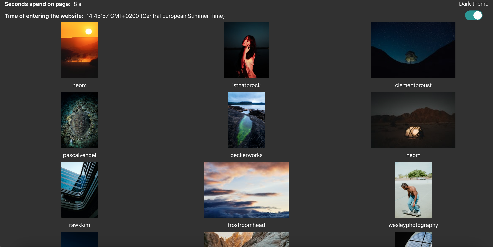

# React test

In this test you need to:
## 1 
solve problem with timer "Seconds spend on page", why it is not working? It should show seconds spend on page, timer should clearing after refresh
## 2 
"Time of entering the website" should show time after page load. If "Seconds spend on page" is working correctly time of entering page is updating . It should not updating each second
## 3 
apply dark theme mechanism - use class `dark-mode` in `App.js` file. Theme setting should be cached, after page refresh theme must be the same as before page refresh
## 4
apply infinite scroll with mock data. In `./src/api.js` there is a funtion for calling mock API, use it to create infinite scroll - first 30 items load, then after scrolling to bottom you need to fetch more 30 items. Display data in grid, each grid item should display image and name of the author.Use redux to store data

Check the unsplash API for photos details `https://unsplash.com/documentation`

Example: 

# How to run?

## Install dependencies
`yarn install`

## Start app
`yarn start`

# You have 3 hours to solve this. When you finish, upload to your github and send link to repo. Goold luck

